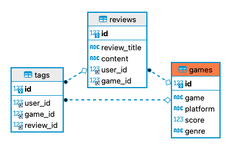
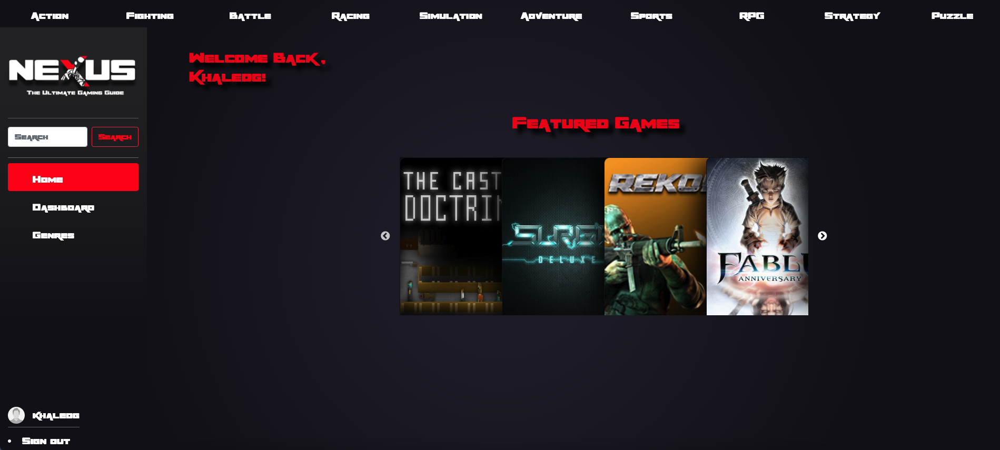
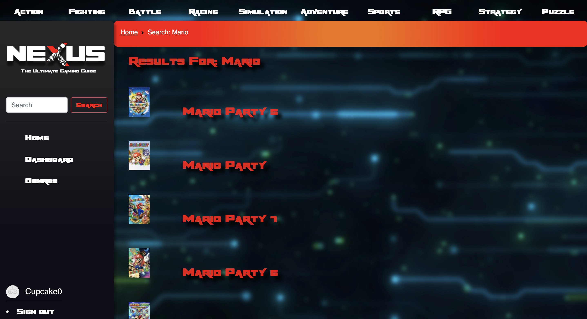
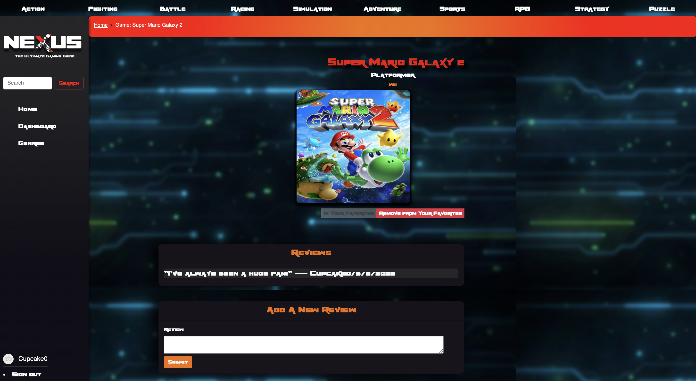

# 🎮 Welcome to Nexus

## Table of Contents
- [🎮  Nexus](#-nexus)
  - [Table of Contents](#table-of-contents)
  - [🔎 Overview](#-overview)
  - [👥 Contributors](#-contributors)
  - [💻 Technologies](#-technologies)
  - [💾 Database Table Associations](#-database-associations)
  - [🖼️ Images](#-images)

 

## 🔎 Overview
Nexus is an application that gives users the ability to search through video games, read/write reviews, and add games to their list of favorites to come back to!
 
 
## 👥 Contributors
[Khaled Ghanem](https://github.com/khaledghanem1) 
[Noor Ridha](https://github.com/Nridha0) 
[Alex Saunders](https://github.com/alxsaunders)  
[Arian](https://github.com/Servbt) 
[Rhea Le](https://github.com/rheangocle) 
 
## 💻 Technologies

|                       Technologies Used                        |
| :------------------------------------------------------------: |
|                             HTML5                              |
|                              CSS3                              |
|            [Boostrap 5](https://getbootstrap.com/)             |
|                         JavaScript ES6                         |
|                [NodeJS](https://nodejs.org/en/)                |
| [bcrypt](https://www.npmjs.com/package/bcrypt)                 |
| [Handlebars](https://www.npmjs.com/package/express-handlebars) |
|              [ExpressJS (session + handlebars)](https://expressjs.com/)               |
|              [Sequelize](https://sequelize.org/)               |
|                [MySQL](https://www.mysql.com/)                 |
|                [MySQL2 NPM package](https://www.npmjs.com/package/mysql2)    |
|               [Slick-Carousel](https://www.npmjs.com/package/slick-carousel)                |
| [Twich API](https://dev.twitch.tv/docs/api/)                 |
 

## 💾  Database Associations

 
 
## 🖼️  Images

